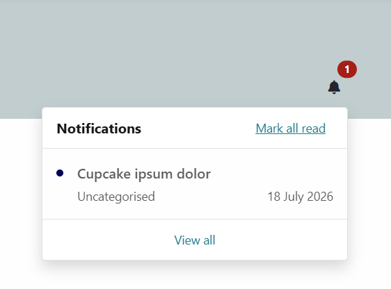
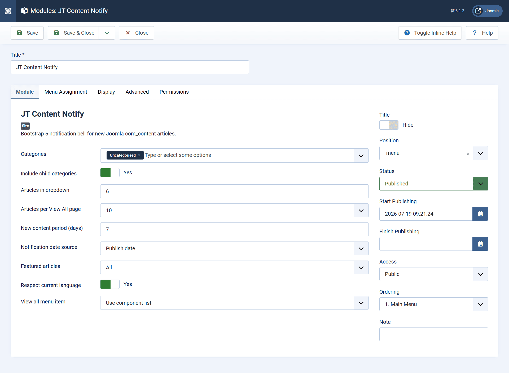
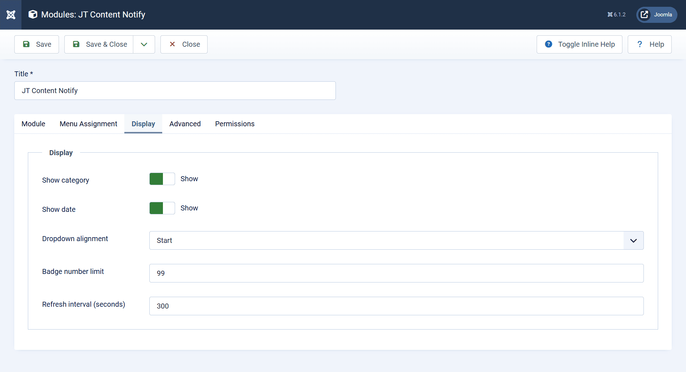
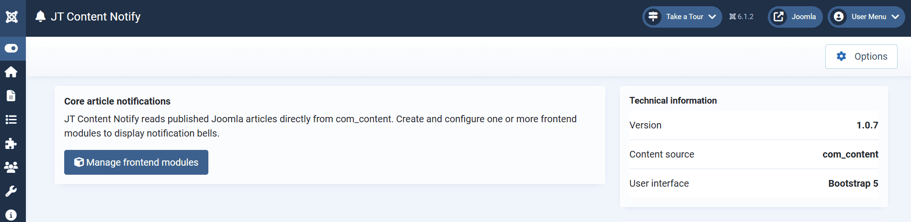

# JT Content Notify

[](https://www.joomla.org/)
[](https://www.php.net/)
[](LICENSE)
[](https://extensions.joomla.org/profile/profile/details/147240)

**JT Content Notify** adds a lightweight frontend notification centre for Joomla core articles.

It works directly with com_content and displays newly published or updated content through a notification bell, unread counter, Bootstrap 5 dropdown, and a paginated View All page.

No separate notification content type is required. Articles remain ordinary Joomla articles and continue to use Joomla routing, access levels, language filtering, publishing dates, category permissions, and SEF URLs.

## Screenshots

### Frontend notification dropdown



### Paginated View All page


### Module configuration




### Administrator component



## Features

* Frontend notification bell with unread badge
* Bootstrap 5 dropdown with recent articles
* Joomla core pagination on the **View All** page
* Dedicated Joomla menu item type for the notification centre
* Category and child-category filtering
* Publish, created, or modified date as the notification source
* Configurable new-content period
* Featured article filtering
* Joomla ACL and authorised view-level support
* Article and category access validation
* Current-language filtering for multilingual sites
* Joomla menu assignment validation
* Scheduled publishing support through `publish_up` and `publish_down`
* Logged-in user read state stored in the database
* Guest read state stored in browser `localStorage`
* Guest read-state synchronisation between the dropdown and View All page
* **Mark all as read** action
* Article clicks update the read state before navigation
* Configurable dropdown item count and page size
* Configurable category and date visibility
* Component Options and Permissions support
* English and Turkish language files
* Joomla Web Asset Manager integration
* Joomla MVC and dependency injection architecture
* Joomla Privacy export and removal integration
* Automatic cleanup of orphaned user and module read-state records
* Visibility-aware automatic refresh
* Concurrent AJAX request protection
* No bundled third-party framework

## Requirements

| Requirement |                                         Minimum |
| ----------- | ----------------------------------------------: |
| Joomla      |                                             6.1 |
| PHP         |                                             8.3 |
| Database    | MySQL/MariaDB or PostgreSQL supported by Joomla |
| Frontend    |      A Joomla template with Bootstrap 5 support |

JT Content Notify is designed for Joomla 6.1.x and follows the core Cassiopeia and Atum interface conventions.

The extension uses Joomla's bundled Bootstrap 5 assets and does not include a separate Bootstrap distribution.

## Installation

1. Download the latest `pkg_jtcontentnotify-*.zip` file from [GitHub Releases](https://github.com/joomtheme/JT-Content-Notify/releases/latest).
2. In Joomla Administrator, open **System → Install → Extensions**.
3. Upload the package ZIP.
4. Open **Content → Site Modules**.
5. Create or edit a **JT Content Notify** module.
6. Select the categories to monitor.
7. Configure the notification period, date source, display options, and refresh interval.
8. Publish the module in a suitable template position near the main menu.

The complete package installs:

* The administrator and site component
* The frontend notification module
* The Joomla Privacy integration plugin
* The system cleanup plugin

Existing installations can be updated by installing a newer package over the current version or through Joomla's extension updater.

## Module configuration

### Content

* **Categories** — Select one or more `com_content` categories.
* **Include child categories** — Include articles from child categories.
* **Articles in dropdown** — Maximum number of articles shown in the notification menu.
* **New content period** — Number of days an article is considered part of the notification period.
* **Notification date source** — Use publish, created, or modified date.
* **Featured articles** — Show all, exclude featured, or show only featured articles.
* **Respect current language** — Restrict results to the active site language and `*`.
* **View All menu item** — Link to a selected notification-centre menu item or use the component fallback URL.
* **Articles per page** — Number of records displayed on the paginated View All page.

### Display

* Show or hide the article category
* Show or hide the article date
* Configure dropdown alignment
* Configure the badge number limit
* Configure the automatic refresh interval

### Permissions

The component uses Joomla's standard ACL actions:

* `core.manage` — Access the administrator component
* `core.options` — Configure component options
* `core.admin` — Configure options and permissions

## Creating a View All menu item

JT Content Notify includes a dedicated Joomla menu item type for the notification centre.

To create one:

1. Open **Menus** in Joomla Administrator.
2. Create a new menu item.
3. Select **JT Content Notify → Notifications** as the menu item type.
4. Select the related JT Content Notify module.
5. Configure the menu title, alias, language, access level, and template style.
6. Save and publish the menu item.
7. Select this menu item in the module's **View All menu item** setting.

Using a dedicated menu item provides consistent SEF routing, language handling, breadcrumbs, page titles, and template assignments.

## How read status works

### Logged-in users

The last-read state is stored server-side in:

```text
#__jtcontentnotify_state
```

The state is stored per user and per module instance. This allows the same Joomla account to retain its notification state across sessions and devices.

State updates use protected POST requests with Joomla CSRF token validation.

### Guests

Guest state is stored in browser `localStorage`.

It is specific to the current browser and device. Clearing browser storage, using private browsing, or changing devices resets the guest notification state.

The guest read state is synchronised between:

* The notification dropdown
* The paginated View All page
* The **Mark all as read** action
* Article-link navigation

### Mark all as read

Opening the **View All** page does not automatically mark every article as read.

The user must select **Mark all as read**. Clicking an unread article also updates the read timestamp before opening the article.

## Joomla routing and module context

JT Content Notify preserves the active Joomla request context when loading notifications.

AJAX requests retain the relevant:

* `Itemid`
* Site language
* Menu context
* Module instance
* Access levels

Before returning notification data, the extension verifies that the module:

* Exists
* Is enabled
* Is published
* Is assigned to the active menu item
* Matches the active language
* Is within its publishing date range
* Is accessible to the current user

Article links are generated through Joomla's core `com_content` routing.

## Joomla content integration

JT Content Notify reads directly from Joomla core content and respects:

* Article publication state
* Category publication state
* Article and category access levels
* Authorised view levels
* `publish_up` and `publish_down`
* Current site language
* Joomla SEF routing
* Category hierarchy
* Featured state
* Active module configuration
* Module language
* Module publishing dates
* Module menu assignments

The extension does not duplicate Joomla articles or create a separate notification-content table.

## Package structure

The installation package contains four extensions:

```text
pkg_jtcontentnotify
├── com_jtcontentnotify
│   ├── Administrator component
│   ├── Site notification centre
│   ├── AJAX controllers
│   ├── Read-state storage
│   ├── Joomla menu item type
│   └── MySQL and PostgreSQL schemas
├── mod_jtcontentnotify
│   ├── Frontend notification bell
│   ├── Unread badge
│   ├── Bootstrap 5 dropdown
│   └── Automatic refresh
├── plg_privacy_jtcontentnotify
│   ├── Privacy data export
│   └── Privacy data removal
└── plg_system_jtcontentnotify
    ├── Deleted-user state cleanup
    └── Deleted-module state cleanup
```

The component and module provide the main notification functionality.

The Privacy plugin integrates stored user read-state data with Joomla's Privacy component. The system plugin removes obsolete state rows when related users or module instances are deleted.

## Privacy

JT Content Notify does not create a separate article store.

For logged-in users, it stores only the minimum information required to maintain notification read state:

* Joomla user ID
* JT Content Notify module ID
* Last-read timestamp

The included Privacy plugin integrates this data with Joomla's personal-data export and removal workflows.

Guest read state remains entirely in the visitor's browser through `localStorage` and is not written to the Joomla database.

The system cleanup plugin removes orphaned state records when a Joomla user or JT Content Notify module instance is deleted.

## Security

JT Content Notify follows Joomla security conventions:

* Joomla CSRF token validation for state-changing requests
* Bound database query parameters
* Joomla ACL and authorised view-level checks
* Article and category access validation
* Module publication and menu-assignment validation
* Escaped template output
* DOM construction through safe text APIs
* Generic public error responses
* Server-side exception logging
* Joomla Web Asset Manager integration
* No `eval`, obfuscated code, or bundled remote scripts

Security-sensitive reports should not be posted publicly. See [SECURITY.md](SECURITY.md).

## Performance

Automatic refresh pauses while the browser tab is hidden.

The frontend also prevents overlapping AJAX requests, reducing unnecessary duplicate database queries on slow connections or short refresh intervals.

For high-traffic sites, a reasonable refresh interval should be selected according to the number of visitors, monitored categories, and notification modules displayed on each page.

## Database support

JT Content Notify includes installation and update schemas for:

* MySQL
* MariaDB
* PostgreSQL

The database table is created during installation and removed when the component is uninstalled.

Upgrade schema files are included to support future database changes through Joomla's extension update process.

## Updates

The package includes a Joomla update server definition.

* Update manifest: [`updates/update.xml`](updates/update.xml)
* Joomla changelog: [`updates/changelog.xml`](updates/changelog.xml)
* Human-readable changelog: [`CHANGELOG.md`](CHANGELOG.md)
* Releases: [GitHub Releases](https://github.com/joomtheme/JT-Content-Notify/releases)

When publishing a release, the tag and asset must follow this format:

```text
Tag:   v1.0.8
Asset: pkg_jtcontentnotify-1.0.8.zip
```

The following values in `updates/update.xml` must match the published release asset:

* Version
* Download URL
* Joomla target platform
* Minimum PHP version
* SHA-256 checksum

See the [release checklist](docs/RELEASE_CHECKLIST.md) before publishing a new version.

## Support and resources

* [JoomTheme website](https://joomtheme.com) — Product information and support
* [GitHub Issues](https://github.com/joomtheme/JT-Content-Notify/issues) — Reproducible bugs and feature requests
* [JoomTheme on the Joomla Extensions Directory](https://extensions.joomla.org/profile/profile/details/147240) — Extension profile and reviews
* Email: [support@joomtheme.com](mailto:support@joomtheme.com)

Before reporting a bug, include:

* JT Content Notify version
* Joomla version
* PHP version
* Database type and version
* Template name
* Active site language
* User state: guest or logged in
* Module configuration
* Clear reproduction steps
* Relevant browser-console or Joomla log output

## Contributing

Contributions are welcome.

Please read [CONTRIBUTING.md](CONTRIBUTING.md) before opening a pull request.

Development should follow Joomla coding conventions and retain compatibility with:

* Joomla MVC
* Dependency injection
* Bootstrap 5
* Web Asset Manager
* Joomla ACL
* Multilingual filtering
* Joomla Privacy
* MySQL and PostgreSQL
* Core `com_content` routing

## License

JT Content Notify is free software distributed under the **GNU General Public License version 2 or later**.

See [LICENSE](LICENSE).

## Credits

Developed and maintained by [JoomTheme](https://joomtheme.com).
