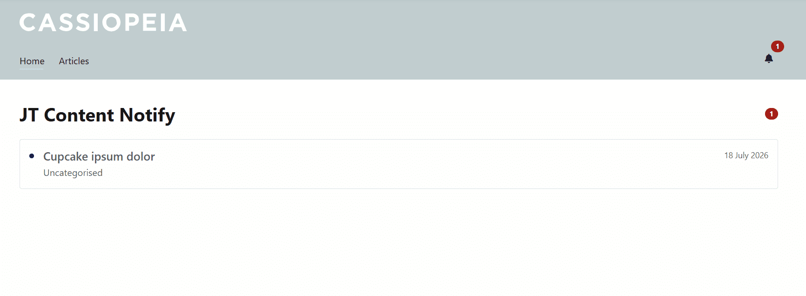

# JT Content Notify

[](https://www.joomla.org/)
[](https://www.php.net/)
[](LICENSE)
[](https://extensions.joomla.org/profile/profile/details/147240)

**JT Content Notify** adds a lightweight frontend notification centre for Joomla core articles. It works directly with `com_content` and displays newly published content through a notification bell, unread counter, Bootstrap 5 dropdown, and a paginated **View All** page.

No separate notification content type is required. Articles remain ordinary Joomla articles and continue to use Joomla routing, access levels, language filtering, publishing dates, and category permissions.

## Screenshots

### Frontend notification dropdown


### Paginated View All page




## Features

- Frontend notification bell with unread badge
- Bootstrap 5 dropdown with recent articles
- Joomla core pagination on the **View All** page
- Category and child-category filtering
- Publish, created, or modified date as the notification source
- Configurable new-content period
- Featured article filtering
- Joomla ACL and authorised view-level support
- Current-language filtering for multilingual sites
- Scheduled publishing support through `publish_up` and `publish_down`
- Logged-in user read state stored in the database
- Guest read state stored in browser `localStorage`
- **Mark all as read** action
- Configurable dropdown item count and page size
- Component Options and Permissions support
- English and Turkish language files
- Joomla Web Asset Manager integration
- Joomla MVC architecture
- No third-party framework dependency

## Requirements

| Requirement | Minimum |
|---|---:|
| Joomla | 6.1 |
| PHP | 8.3 |
| Database | MySQL/MariaDB or PostgreSQL supported by Joomla |
| Frontend | A Joomla template with Bootstrap 5 support |

JT Content Notify is designed for Joomla 6.1.x and follows the core Cassiopeia and Atum interface conventions.

## Installation

1. Download the latest `pkg_jtcontentnotify-*.zip` file from [GitHub Releases](https://github.com/joomtheme/JT-Content-Notify/releases/latest).
2. In Joomla Administrator, open **System → Install → Extensions**.
3. Upload the package ZIP.
4. Open **Content → Site Modules**.
5. Create or edit a **JT Content Notify** module.
6. Select the categories to monitor.
7. Publish the module in a suitable template position near the main menu.

Existing installations can be updated by installing a newer package over the current version or through Joomla's extension updater.

## Module configuration

### Content

- **Categories** — Select one or more `com_content` categories.
- **Include child categories** — Include articles from child categories.
- **Articles in dropdown** — Maximum number of articles shown in the notification menu.
- **New content period** — Number of days an article is considered part of the notification period.
- **Notification date source** — Use publish, created, or modified date.
- **Featured articles** — Show all, exclude featured, or show only featured articles.
- **Respect current language** — Restrict results to the active site language and `*`.
- **View All menu item** — Link to a selected menu item or the component notification list.
- **Articles per page** — Number of records displayed on the paginated View All page.

### Display

- Show or hide article category
- Show or hide article date
- Dropdown alignment
- Badge number limit
- Automatic refresh interval

### Permissions

The component uses Joomla's standard ACL actions:

- `core.manage` — Access the administrator component
- `core.options` — Configure component options
- `core.admin` — Configure options and permissions

## How read status works

### Logged-in users

The last-read state is stored server-side in `#__jtcontentnotify_state`. This allows the same account to retain its notification state across sessions.

### Guests

Guest state is stored in browser `localStorage`. It is specific to the current browser and device. Clearing browser storage resets the guest notification state.

Opening **View All** does not automatically mark everything as read. The user must select **Mark all as read**.

## Joomla integration

JT Content Notify reads directly from Joomla core content and respects:

- Article and category publication state
- `publish_up` and `publish_down`
- Access and view levels
- Current language
- Joomla SEF routing
- Category hierarchy
- Featured state
- Active module configuration

The installation package contains:

```text
pkg_jtcontentnotify
├── com_jtcontentnotify   # MVC component, read state, AJAX and View All page
└── mod_jtcontentnotify   # Frontend bell, badge and dropdown interface
```

## Updates

The package includes a Joomla update server definition.

- Update manifest: [`updates/update.xml`](updates/update.xml)
- Joomla changelog: [`updates/changelog.xml`](updates/changelog.xml)
- Human-readable changelog: [`CHANGELOG.md`](CHANGELOG.md)
- Releases: [GitHub Releases](https://github.com/joomtheme/JT-Content-Notify/releases)

When publishing a release, the tag and asset should follow this format:

```text
Tag:   v1.0.7
Asset: pkg_jtcontentnotify-1.0.7.zip
```

The version, download URL, and SHA-256 value in `updates/update.xml` must match the published release asset. See the [release checklist](docs/RELEASE_CHECKLIST.md).

## Support and resources

- [JoomTheme website](https://joomtheme.com) — Product information and support
- [GitHub Issues](https://github.com/joomtheme/JT-Content-Notify/issues) — Reproducible bugs and feature requests
- [JoomTheme on the Joomla Extensions Directory](https://extensions.joomla.org/profile/profile/details/147240) — Extension profile and reviews
- Email: [support@joomtheme.com](mailto:support@joomtheme.com)

Before reporting a bug, include the JT Content Notify version, Joomla version, PHP version, template name, user state (guest or logged in), and clear reproduction steps.

Security-sensitive reports should not be posted publicly. See [SECURITY.md](SECURITY.md).

## Contributing

Contributions are welcome. Please read [CONTRIBUTING.md](CONTRIBUTING.md) before opening a pull request.

Development should follow Joomla coding conventions and retain compatibility with Joomla MVC, Bootstrap 5, Web Asset Manager, ACL, multilingual filtering, and core `com_content` routing.

## Privacy

JT Content Notify does not create a separate article store. It reads Joomla articles and stores only the minimum notification read-state data required for logged-in users. Guest read state remains in the visitor's browser.

## License

JT Content Notify is free software distributed under the **GNU General Public License version 2 or later**. See [LICENSE](LICENSE).

## Credits

Developed and maintained by [JoomTheme](https://joomtheme.com).
